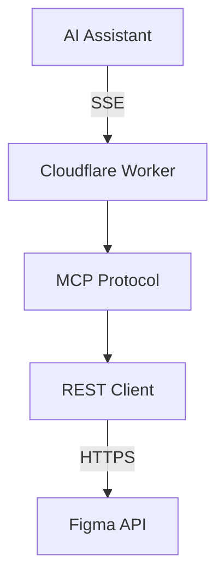
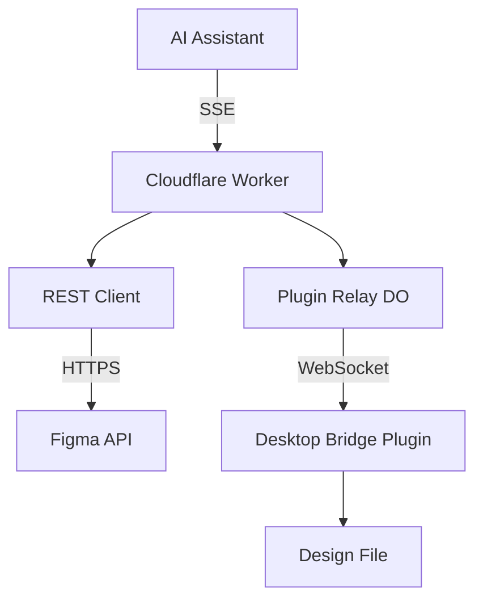
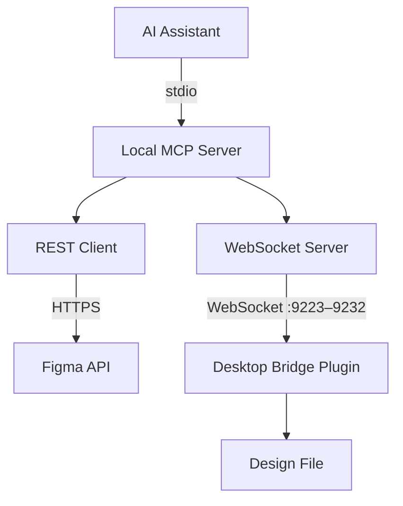
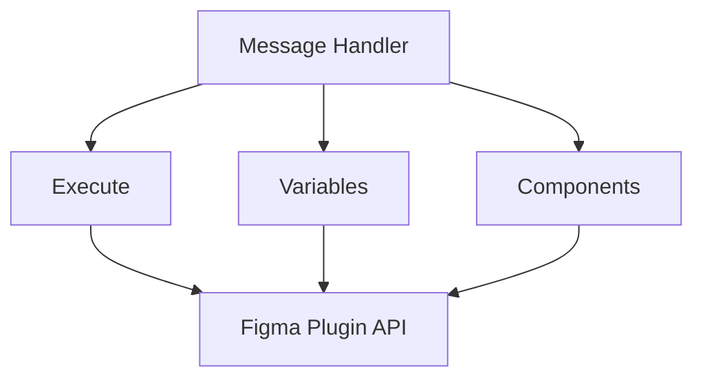
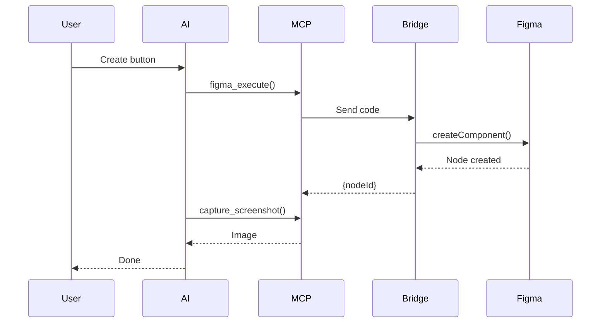
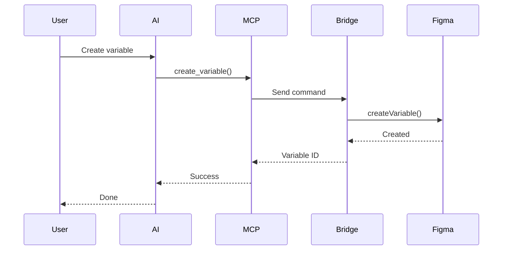
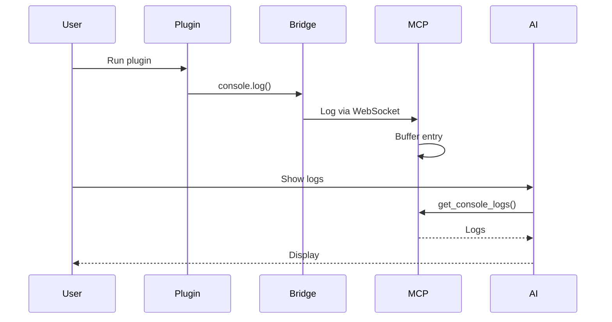

# Figma Console MCP - Technical Architecture

## Overview

Figma Console MCP provides AI assistants with real-time access to Figma for debugging, design system extraction, and design creation. The server supports two deployment modes with different capabilities.

## Deployment Modes

### Remote Mode (SSE/OAuth)

**Best for:** Design system extraction, API-based operations, zero-setup experience

Remote Mode has two sub-modes depending on whether the Desktop Bridge plugin is paired:

#### Read-Only (REST API via OAuth/PAT)



**Capabilities:**
- Design system extraction (variables, styles, components)
- File structure queries
- Component images

#### Read + Write (REST API + Cloud Write Relay)

When a user pairs the Desktop Bridge plugin via Cloud Mode, Remote Mode gains full write access through the cloud relay:



**Additional Capabilities (with Cloud Relay):**
- Design creation via Plugin API
- Variable CRUD operations
- Component arrangement and organization
- Console log capture

---

### Local Mode (Desktop Bridge)

**Best for:** Plugin debugging, design creation, variable management, full capabilities



**Transport:**
- **WebSocket + HTTP** — via Desktop Bridge Plugin on ports 9223–9232. No debug flags needed. Supports real-time selection tracking, document change monitoring, and console capture.
- The server tries port 9223 first, then automatically falls back through ports 9224–9232 if another instance is already running. Orphaned processes are automatically detected and terminated on startup.
- The same port serves both WebSocket (plugin communication) and HTTP (bootloader UI delivery at `/plugin/ui` and health checks at `/health`).
- All 94+ tools work through the WebSocket transport.

**Bootloader Architecture (v1.14.0+):**
- The Desktop Bridge plugin uses a thin bootloader (`ui.html`, ~120 lines) that Figma caches permanently.
- On each plugin open, the bootloader scans ports 9223–9232 via WebSocket, finds the MCP server, and requests the full UI HTML via a `GET_PLUGIN_UI` WebSocket message.
- The server responds with the complete plugin UI (~50KB), which the bootloader passes to `code.js` to load via `figma.showUI()`.
- This means the plugin UI is always up-to-date with the running server — no re-importing needed after the initial setup.
- Plugin files are also copied to `~/.figma-console-mcp/plugin/` for a stable import path.

**Capabilities:**
- Everything in Remote Mode, plus:
- Console log capture (real-time)
- Design creation via Plugin API
- Variable CRUD operations
- Component arrangement and organization
- Real-time selection and document change tracking (WebSocket)
- Zero-latency local execution

---

## Component Details

### MCP Server Core (`src/local.ts`)

The main server implements the Model Context Protocol with stdio transport for local mode.

**Key Responsibilities:**
- Tool registration (94+ tools in Local Mode, 9 in Remote Mode)
- Request routing and validation
- Figma API client management
- Desktop Bridge communication via WebSocket

**Tool Categories:**

| Category | Tools | Transport |
|----------|-------|-----------|
| Navigation | `figma_navigate`, `figma_get_status` | WebSocket |
| Console | `figma_get_console_logs`, `figma_watch_console`, `figma_clear_console` | WebSocket |
| Screenshots | `figma_take_screenshot`, `figma_capture_screenshot` | WebSocket |
| Design System | `figma_get_variables`, `figma_get_styles`, `figma_get_component` | REST API |
| Design Creation | `figma_execute`, `figma_arrange_component_set` | WebSocket (Plugin) |
| Variables | `figma_create_variable`, `figma_update_variable`, etc. | WebSocket (Plugin) |
| Real-Time | `figma_get_selection`, `figma_get_design_changes` | WebSocket |

---

### Desktop Bridge Plugin

The Desktop Bridge is a Figma plugin that runs inside Figma Desktop and provides access to the full Figma Plugin API.

**Architecture:**



**Communication Protocol:**

The MCP server communicates with the Desktop Bridge via WebSocket:

1. **MCP Server** sends JSON command via WebSocket (ports 9223–9232)
2. **Plugin UI** receives and forwards via `postMessage` to plugin code
3. **Plugin Code** executes Figma Plugin API calls
4. **Plugin Code** returns result via `figma.ui.postMessage`
5. **Plugin UI** sends response back via WebSocket
6. **MCP Server** receives correlated response

---

### Transport Layer

The MCP server uses a transport abstraction (`IFigmaConnector` interface) with three connector implementations:

| Connector | Class | Mode | Transport |
|-----------|-------|------|-----------|
| Local WebSocket | `WebSocketConnector` | Local | `ws://localhost:9223–9232` |
| Local Desktop | `FigmaDesktopConnector` | Local | CDP fallback |
| Cloud Relay | `CloudWebSocketConnector` | Remote | Fetch RPC to Durable Object |

#### WebSocket Transport (Local)

The Desktop Bridge Plugin connects via WebSocket on ports 9223–9232. No special Figma launch flags needed.

**Features:**
- Real-time selection tracking (`figma_get_selection`)
- Document change monitoring (`figma_get_design_changes`)
- File identity tracking (file key, name, current page)
- Plugin-context console capture
- Instant availability check (no network timeout)

**Communication flow:**
```
MCP Server ←WebSocket (ports 9223–9232)→ Plugin UI (ui.html) ←postMessage→ Plugin Code (code.js) ←figma.*→ Figma
```

#### Cloud Relay Transport (Remote)

The `CloudWebSocketConnector` implements the same `IFigmaConnector` interface but routes commands via fetch RPC to the `PluginRelayDO` Durable Object. The DO maintains a persistent WebSocket connection to the Desktop Bridge plugin.

**Communication flow:**
```
Cloud MCP Server →fetch RPC→ PluginRelayDO ←WebSocket (wss://)→ Plugin UI (ui.html) ←postMessage→ Plugin Code (code.js) ←figma.*→ Figma
```

See [Cloud Write Relay](#cloud-write-relay) for full details.

#### Multi-Instance Support (v1.10.0+)

Multiple MCP server processes can run simultaneously (e.g., Claude Desktop Chat tab, Code tab, Cursor, etc.). Each server binds to the first available port in the range 9223–9232. The Desktop Bridge Plugin scans all ports in the range and connects to every active server.

#### Transport Detection

The MCP server checks if a WebSocket client is connected (instant, under 1ms). If connected, commands route through WebSocket. If no client is connected, setup instructions are returned.

All 94+ tools work through the WebSocket transport.

---

### Figma REST API Client

Used for design system extraction and file queries.

**Endpoints Used:**

| Endpoint | Purpose |
|----------|---------|
| `GET /v1/files/:key` | File structure and metadata |
| `GET /v1/files/:key/nodes` | Specific node data |
| `GET /v1/files/:key/styles` | Style definitions |
| `GET /v1/files/:key/variables/local` | Variable collections (Enterprise) |
| `GET /v1/images/:key` | Rendered images |

**Authentication:**
- **Remote Mode:** OAuth 2.0 with automatic token refresh
- **Local Mode:** Personal Access Token via environment variable

---

## Data Flow Examples

### Design Creation Flow



### Variable Management Flow



### Console Debugging Flow



---

## Cloud Write Relay

The Cloud Write Relay enables web-based AI clients (Claude.ai, v0, Replit, Lovable) to send write commands to Figma through a Cloudflare Durable Object relay. This gives Remote Mode full write capabilities — design creation, variable management, and component arrangement — without requiring a local Node.js process.

### Architecture

```
AI Client (Claude.ai)
    │
    ▼
Cloud MCP Server (/mcp endpoint on Cloudflare Worker)
    │
    ├──► REST Client ──► Figma REST API (read operations)
    │
    └──► fetch RPC
            │
            ▼
      PluginRelayDO (Durable Object)
            │
            ▼ WebSocket (wss://)
      Desktop Bridge Plugin (ui.html)
            │
            ▼ postMessage
      Plugin Worker (code.js)
            │
            ▼ figma.*
      Figma Plugin API
```

### Key Components

| Component | File | Purpose |
|-----------|------|---------|
| `PluginRelayDO` | `src/core/cloud-websocket-relay.ts` | Durable Object that brokers WebSocket between cloud server and plugin |
| `CloudWebSocketConnector` | `src/core/cloud-websocket-connector.ts` | `IFigmaConnector` implementation that routes commands via fetch RPC to the relay DO |
| `registerWriteTools()` | `src/core/write-tools.ts` | Shared tool registration function used by both local and cloud entry points |

### Pairing Flow

```
AI Client                    Cloud Server              Relay DO                  Desktop Bridge Plugin
    │                             │                        │                            │
    │  figma_pair_plugin          │                        │                            │
    │ ──────────────────────────► │                        │                            │
    │                             │  Create relay DO       │                            │
    │                             │ ─────────────────────► │                            │
    │                             │  Store code in KV      │                            │
    │  ◄─── 6-char code ──────── │  (5-min TTL)           │                            │
    │       (shown to user)       │                        │                            │
    │                             │                        │                            │
    │                             │                        │   WebSocket connect        │
    │                             │                        │   wss://.../ws/pair?code=  │
    │                             │                        │ ◄──────────────────────────│
    │                             │                        │   Code validated, paired   │
    │                             │                        │ ──────────────────────────►│
    │                             │                        │                            │
    │  figma_execute(...)         │                        │                            │
    │ ──────────────────────────► │  fetch RPC             │                            │
    │                             │ ─────────────────────► │  forward via WebSocket     │
    │                             │                        │ ──────────────────────────►│
    │                             │                        │                            │ ──► figma.*
    │                             │                        │  ◄─── result ─────────────│
    │                             │  ◄─── result ──────── │                            │
    │  ◄─── result ────────────── │                        │                            │
```

### Hibernation-Safe Design

The `PluginRelayDO` uses Cloudflare Durable Object hibernation-safe patterns to minimize costs during idle periods between AI turns:

- **WebSocket retrieval:** Uses `this.ctx.getWebSockets('plugin')` to retrieve active connections after hibernation wake-up, rather than storing WebSocket references in memory.
- **File info storage:** Connected file information is persisted to DO storage (`this.ctx.storage`), not held in instance variables that would be lost during hibernation.
- **Wake on message:** The DO wakes from hibernation when either the cloud server sends a fetch RPC or the plugin sends a WebSocket message.

### Tool Registration

`registerWriteTools()` is a shared function that registers all Plugin API write tools (design creation, variable CRUD, component arrangement). It is called from both entry points:

- **`src/local.ts`** — Local mode, tools route through the local `WebSocketConnector`
- **`src/index.ts`** — Remote/cloud mode, tools route through `CloudWebSocketConnector` to the relay DO

This ensures tool parity between local and cloud modes. The same set of write tools is available regardless of deployment path.

---

## Security Considerations

### Authentication

- **Personal Access Tokens:** Stored in environment variables, never logged
- **OAuth Tokens:** Encrypted at rest, automatic refresh
- **No credential storage:** Tokens passed per-request

### Sandboxing

- **Plugin Execution:** Runs in Figma's sandboxed plugin environment
- **Code Validation:** Basic validation before execution
- **No filesystem access:** Plugin code cannot access local files

### Cloud Relay Security

- **Pairing codes:** Single-use, 6-character codes with a 5-minute TTL stored in Cloudflare KV. Codes are consumed on first use and cannot be replayed.
- **Session scoping:** Each pairing creates a dedicated Durable Object instance. One plugin connects per relay — no cross-session leakage.
- **Transport encryption:** All cloud relay traffic uses TLS (`wss://` for the plugin WebSocket, HTTPS for fetch RPC).
- **Bearer token binding:** After pairing, the relay DO ID is stored in KV keyed by the bearer token (`relay:{bearerToken}`, 24h TTL). Only the authenticated AI client session can route commands to its paired relay.
- **No persistent data storage:** The relay passes commands through to the plugin and returns results. Design data is not stored in the Durable Object beyond the active session.

### Data Privacy

- **Console Logs:** Stored in memory only, cleared on restart
- **Screenshots:** Temporary files with automatic cleanup
- **No telemetry:** No data sent to external services

---

## Performance Considerations

### Latency Targets

| Operation | Target | Actual |
|-----------|--------|--------|
| Console log retrieval | under 100ms | ~50ms |
| Screenshot capture | under 2s | ~1s |
| Design creation | under 5s | 1-3s |
| Variable operations | under 500ms | ~200ms |

### Memory Management

- **Log Buffer:** Circular buffer, configurable size (default: 1000 entries)
- **Screenshots:** Disk-based with 1-hour TTL cleanup
- **Connection Pooling:** WebSocket connections reused

### Optimization Strategies

- Batch operations where possible
- Lazy loading of component data
- Efficient JSON serialization
- Connection keepalive for WebSocket

---

## Development

### Local Development

```bash
# Install dependencies
npm install

# Run in development mode
npm run dev:local

# Build for production
npm run build:local
```

### Testing

```bash
# Run all tests
npm test

# Run with coverage
npm run test:coverage
```

### Project Structure

```
figma-console-mcp/
├── src/
│   ├── local.ts                          # Main MCP server (local mode)
│   ├── index.ts                          # Cloudflare Workers entry (remote mode)
│   ├── core/
│   │   ├── cloud-websocket-relay.ts      # PluginRelayDO Durable Object
│   │   ├── cloud-websocket-connector.ts  # CloudWebSocketConnector (IFigmaConnector)
│   │   ├── write-tools.ts               # Shared write tool registration
│   │   ├── websocket-connector.ts        # Local WebSocketConnector (IFigmaConnector)
│   │   ├── websocket-server.ts           # Local WebSocket server
│   │   └── figma-connector.ts            # IFigmaConnector interface
│   └── types/                            # TypeScript definitions
├── figma-desktop-bridge/
│   ├── code.js                           # Plugin worker (Figma API access)
│   ├── ui.html                           # Plugin UI (local + cloud mode)
│   └── manifest.json                     # Plugin manifest
├── docs/                                 # Documentation
└── tests/                                # Test suites
```
