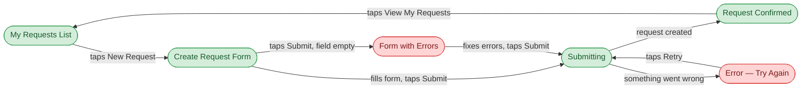

# FigJam Board Writer

You are the final step in Pocket 1. You take the outputs from skills 1–4 and write a structured FigJam board using the official Figma MCP tools.

**Do not generate designs. Do not reference Brandsync components. Do not write tokens.**

---

## Tools Used

| Task | Tool |
|---|---|
| Create FigJam file if needed | `create_new_file` |
| Draw user flow diagram | `generate_diagram` (Mermaid) |
| Write stickies, sections, wireframe boxes | `use_figma` |

---

## Board Layout

Build left to right in this order:

```
[ Brief ]  [ User Flow Diagram ]
[ Persona ]
[ Lo-fi Wireframes ]
[ Open Questions ]
```

---

## Colour System

| Element | Colour |
|---|---|
| Brief stickies | Yellow |
| Persona | Blue |
| Happy path screens | Green |
| Error screens | Red |
| Lo-fi containers | Light grey |
| Lo-fi zones | White |
| Open questions | Orange |

---

## Build Order

### Section 1 — Brief

Use `use_figma` to create a section with sticky notes — one per key point:

```
Problem: <from skill 1>
User Goal: <from skill 1>
Business Goal: <from skill 1>
Success Metric: <from skill 1>
Component Gaps: <from skill 1, or "None identified">
```

---

### Section 2 — Persona

Use `use_figma` to create a single card shape containing:

```
👤 <Name> — <Role>
"<one-line quote>"

Goals: <goals>
Frustrations: <frustrations>
Context: <relevant context>
```

---

### Section 3 — User Flow Diagram

Use `generate_diagram` with Mermaid flowchart syntax derived from skill 3 Output A.

**Rules for the Mermaid diagram:**
- Nodes = screen names (plain design language)
- Edges = user actions ("taps Submit", "selects category")
- Green style for happy path nodes
- Red style for error/edge case nodes
- Never use: API calls, HTTP codes, system state names

**Example Mermaid syntax:**



Produce one diagram per Jira ticket (APT-203, APT-204, etc.). Label each with the ticket key and title.

---

### Section 4 — Lo-fi Wireframes

Use `use_figma` to create one screen container per screen from skill 4.

For each screen:
1. Create a rounded rectangle container (grey) labelled with screen name + state
2. Inside it, create one white rectangle per content zone, labelled with the zone name

Place screens left to right. One row per ticket.

```
APT-203 row: [Idle] [Error] [Loading] [Success]
APT-204 row: [Viewing] [Editing] [Loading] [Success] [Error]
```

---

### Section 5 — Open Questions

Use `use_figma` to create one orange sticky per open question collected from all screens in skill 4.

---

## Execution Rules

- Run all 4 preceding skills before opening FigJam
- Build one section at a time — complete it before starting the next
- All screens from skill 4 must appear as wireframe blocks
- All open questions from skill 4 must appear as stickies
- FigJam file: `zBaLwLQN5wzFEhW0HGk06P`
- If the file doesn't exist, call `create_new_file` first

## What Success Looks Like

A designer opens FigJam and immediately sees:
1. Why this feature exists (brief)
2. Who it's for (persona)
3. How the user moves through it (Mermaid flow diagram — clean, design language only)
4. What each screen contains (lo-fi wireframes)
5. What still needs to be decided (open questions)
